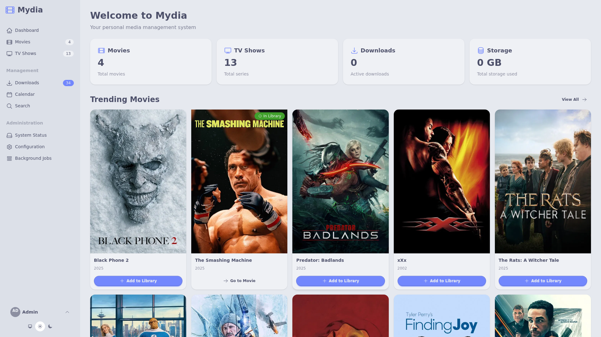
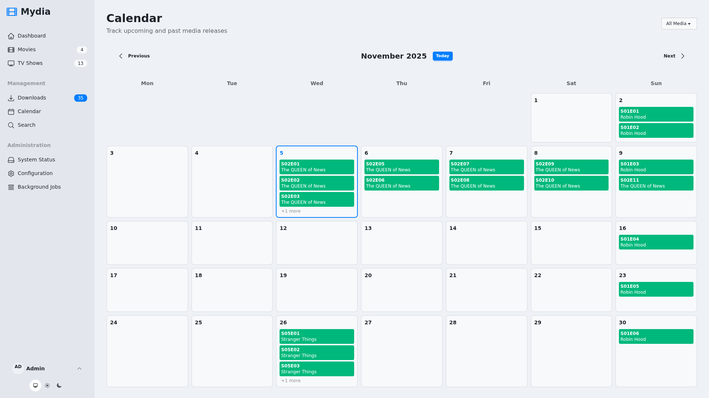
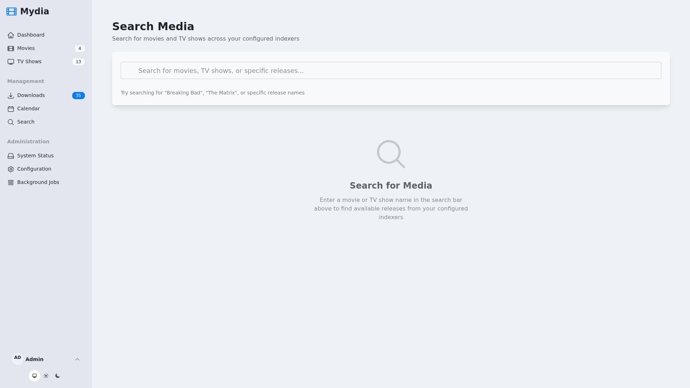

# 🎬 Mydia

> Your personal media companion, built with Phoenix LiveView

A modern, self-hosted media management platform for tracking, organizing, and monitoring your media library.

## ✨ Features

- 📺 **Smart Library Management** – Track TV shows, movies, and episodes with rich metadata
- 🔔 **Release Monitoring** – Never miss new episodes with calendar views and notifications
- 🔍 **Metadata Enrichment** – Automatic metadata fetching and matching
- ⬇️ **Download Integration** – Seamless torrent client connectivity (Transmission, qBittorrent)
- 🎯 **Episode Tracking** – Monitor individual episodes or entire seasons
- 🎨 **Modern UI** – Built with LiveView, Tailwind CSS, and DaisyUI

## 📸 Screenshots

<table>
  <tr>
    <td></td>
    <td></td>
  </tr>
  <tr>
    <td align="center"><b>Homepage</b></td>
    <td align="center"><b>Dashboard</b></td>
  </tr>
  <tr>
    <td></td>
    <td></td>
  </tr>
  <tr>
    <td align="center"><b>Calendar View</b></td>
    <td align="center"><b>Search</b></td>
  </tr>
</table>

## 🚀 Quick Start

### Docker (Recommended)

```bash
# Start everything
./dev up -d

# Run migrations
./dev mix ecto.migrate

# View at http://localhost:4000
# Login: admin / admin
```

See all commands with `./dev`

### Local Development

```bash
mix setup
mix phx.server
```

Visit [localhost:4000](http://localhost:4000)

## 📦 Production Deployment

Pre-built Docker images are available for multiple platforms (amd64, arm64).

### Quick Start

1. **Generate secrets:**

```bash
# Generate SECRET_KEY_BASE
openssl rand -base64 48

# Generate GUARDIAN_SECRET_KEY
openssl rand -base64 48
```

2. **Choose your deployment method below** (Docker Compose or Docker Run)

### Option 1: Docker Compose (Recommended)

Create a `docker-compose.yml` file:

```yaml
services:
  mydia:
    image: ghcr.io/arsfeld/mydia:latest
    container_name: mydia
    restart: unless-stopped

    ports:
      - "4000:4000"

    environment:
      # Required: Security secrets (generate with: openssl rand -base64 48)
      SECRET_KEY_BASE: "your-secret-key-base-here"
      GUARDIAN_SECRET_KEY: "your-guardian-secret-key-here"

      # Required: Database configuration
      DATABASE_PATH: "/data/mydia.db"

      # Server configuration
      PHX_HOST: "localhost"  # Change to your domain
      PORT: "4000"

      # Media library paths (must match volume mounts below)
      MOVIES_PATH: "/media/movies"
      TV_PATH: "/media/tv"

      # Optional: OIDC authentication (leave blank for local auth)
      OIDC_DISCOVERY_DOCUMENT_URI: ""
      OIDC_CLIENT_ID: ""
      OIDC_CLIENT_SECRET: ""

      # Application settings
      MIX_ENV: "prod"
      PHX_SERVER: "true"

    volumes:
      # Database and application data
      - mydia_data:/data

      # Media directories - customize these paths to your media locations
      - /path/to/your/movies:/media/movies
      - /path/to/your/tv:/media/tv
      - /path/to/your/downloads:/media/downloads

    healthcheck:
      test: ["CMD", "curl", "-f", "http://localhost:4000/health"]
      interval: 30s
      timeout: 3s
      start_period: 40s
      retries: 3

volumes:
  mydia_data:
    driver: local
```

Then run:

```bash
docker compose up -d
```

### Option 2: Docker Run

```bash
docker run -d \
  --name mydia \
  --restart unless-stopped \
  -p 4000:4000 \
  -e SECRET_KEY_BASE="your-secret-key-base-here" \
  -e GUARDIAN_SECRET_KEY="your-guardian-secret-key-here" \
  -e DATABASE_PATH="/data/mydia.db" \
  -e PHX_HOST="localhost" \
  -e PORT="4000" \
  -e MOVIES_PATH="/media/movies" \
  -e TV_PATH="/media/tv" \
  -e MIX_ENV="prod" \
  -e PHX_SERVER="true" \
  -v mydia_data:/data \
  -v /path/to/your/movies:/media/movies \
  -v /path/to/your/tv:/media/tv \
  -v /path/to/your/downloads:/media/downloads \
  ghcr.io/arsfeld/mydia:latest
```

### Configuration

See the **[Environment Variables Reference](#-environment-variables-reference)** section below for all supported configuration options including:
- Download client integration (qBittorrent, Transmission)
- Indexer configuration (Prowlarr, Jackett)
- OIDC authentication
- Database tuning
- Logging and background jobs

### Upgrading

To upgrade to a new version:

```bash
# With Docker Compose
docker compose pull
docker compose up -d

# With Docker Run
docker pull ghcr.io/arsfeld/mydia:latest
docker stop mydia && docker rm mydia
# Then run the docker run command again
```

Migrations run automatically on startup.

See [DEPLOYMENT.md](docs/deployment/DEPLOYMENT.md) for advanced deployment topics.

## 📋 Environment Variables Reference

### Required Variables

| Variable | Description | Example |
|----------|-------------|---------|
| `SECRET_KEY_BASE` | Phoenix secret key for cookies/sessions | Generate with: `openssl rand -base64 48` |
| `GUARDIAN_SECRET_KEY` | JWT signing key for authentication | Generate with: `openssl rand -base64 48` |
| `DATABASE_PATH` | Path to SQLite database file | `/data/mydia.db` |

### Server Configuration

| Variable | Description | Default |
|----------|-------------|---------|
| `PHX_HOST` | Public hostname for the application | `localhost` |
| `PORT` | Web server port | `4000` |
| `HOST` | Server binding address | `0.0.0.0` |
| `URL_SCHEME` | URL scheme for external links (http/https) | `http` |

### Media Library

| Variable | Description | Default |
|----------|-------------|---------|
| `MOVIES_PATH` | Movies directory path | `/media/movies` |
| `TV_PATH` | TV shows directory path | `/media/tv` |
| `MEDIA_SCAN_INTERVAL_HOURS` | Hours between library scans | `1` |

### Authentication

| Variable | Description | Default |
|----------|-------------|---------|
| `LOCAL_AUTH_ENABLED` | Enable local username/password auth | `true` |
| `OIDC_ENABLED` | Enable OIDC/OpenID Connect auth | `false` |
| `OIDC_DISCOVERY_DOCUMENT_URI` | OIDC discovery endpoint URL | - |
| `OIDC_CLIENT_ID` | OIDC client ID | - |
| `OIDC_CLIENT_SECRET` | OIDC client secret | - |
| `OIDC_REDIRECT_URI` | OIDC callback URL | Auto-computed |
| `OIDC_SCOPES` | Space-separated scope list | `openid profile email` |

### Download Clients

Configure multiple download clients using numbered environment variables (`<N>` = 1, 2, 3, etc.):

| Variable Pattern | Description | Example |
|-----------------|-------------|---------|
| `DOWNLOAD_CLIENT_<N>_NAME` | Client display name | `qBittorrent` |
| `DOWNLOAD_CLIENT_<N>_TYPE` | Client type (qbittorrent, transmission, http) | `qbittorrent` |
| `DOWNLOAD_CLIENT_<N>_ENABLED` | Enable this client | `true` |
| `DOWNLOAD_CLIENT_<N>_PRIORITY` | Client priority (higher = preferred) | `1` |
| `DOWNLOAD_CLIENT_<N>_HOST` | Client hostname or IP | `qbittorrent` |
| `DOWNLOAD_CLIENT_<N>_PORT` | Client port | `8080` |
| `DOWNLOAD_CLIENT_<N>_USE_SSL` | Use SSL/TLS connection | `false` |
| `DOWNLOAD_CLIENT_<N>_USERNAME` | Authentication username | - |
| `DOWNLOAD_CLIENT_<N>_PASSWORD` | Authentication password | - |
| `DOWNLOAD_CLIENT_<N>_CATEGORY` | Default download category | - |
| `DOWNLOAD_CLIENT_<N>_DOWNLOAD_DIRECTORY` | Download output directory | - |

Example for two download clients:

```bash
# qBittorrent
DOWNLOAD_CLIENT_1_NAME=qBittorrent
DOWNLOAD_CLIENT_1_TYPE=qbittorrent
DOWNLOAD_CLIENT_1_HOST=qbittorrent
DOWNLOAD_CLIENT_1_PORT=8080
DOWNLOAD_CLIENT_1_USERNAME=admin
DOWNLOAD_CLIENT_1_PASSWORD=adminpass

# Transmission
DOWNLOAD_CLIENT_2_NAME=Transmission
DOWNLOAD_CLIENT_2_TYPE=transmission
DOWNLOAD_CLIENT_2_HOST=transmission
DOWNLOAD_CLIENT_2_PORT=9091
DOWNLOAD_CLIENT_2_USERNAME=admin
DOWNLOAD_CLIENT_2_PASSWORD=adminpass
```

### Indexers

Configure multiple indexers using numbered environment variables (`<N>` = 1, 2, 3, etc.):

| Variable Pattern | Description | Example |
|-----------------|-------------|---------|
| `INDEXER_<N>_NAME` | Indexer display name | `Prowlarr` |
| `INDEXER_<N>_TYPE` | Indexer type (prowlarr, jackett, public) | `prowlarr` |
| `INDEXER_<N>_ENABLED` | Enable this indexer | `true` |
| `INDEXER_<N>_PRIORITY` | Indexer priority (higher = preferred) | `1` |
| `INDEXER_<N>_BASE_URL` | Indexer base URL | `http://prowlarr:9696` |
| `INDEXER_<N>_API_KEY` | Indexer API key | - |
| `INDEXER_<N>_INDEXER_IDS` | Comma-separated indexer IDs | `1,2,3` |
| `INDEXER_<N>_CATEGORIES` | Comma-separated categories | `movies,tv` |
| `INDEXER_<N>_RATE_LIMIT` | API rate limit (requests/sec) | - |

Example for Prowlarr:

```bash
INDEXER_1_NAME=Prowlarr
INDEXER_1_TYPE=prowlarr
INDEXER_1_BASE_URL=http://prowlarr:9696
INDEXER_1_API_KEY=your-prowlarr-api-key-here
```

### Database Configuration

| Variable | Description | Default |
|----------|-------------|---------|
| `POOL_SIZE` | Database connection pool size | `5` |
| `DATABASE_TIMEOUT` | Query timeout (milliseconds) | `5000` |
| `SQLITE_CACHE_SIZE` | SQLite cache size (negative = MB) | `-64000` |
| `SQLITE_BUSY_TIMEOUT` | Lock wait timeout (milliseconds) | `5000` |
| `SQLITE_JOURNAL_MODE` | Journal mode (wal recommended) | `wal` |
| `SQLITE_SYNCHRONOUS` | Sync mode (normal, full) | `normal` |

### Background Jobs & Logging

| Variable | Description | Default |
|----------|-------------|---------|
| `DOWNLOAD_MONITOR_INTERVAL_MINUTES` | Minutes between download status checks | `2` |
| `LOG_LEVEL` | Application log level (debug, info, warning, error) | `info` |
| `OBAN_POLL_INTERVAL` | Job queue poll interval (milliseconds) | `1000` |
| `OBAN_MAX_AGE_DAYS` | Days to retain completed jobs | `7` |

### Configuration Precedence

Configuration is loaded in this order (highest to lowest priority):

1. **Environment Variables** - Override everything
2. **Database Settings** - Configured via Admin UI
3. **YAML File** - From `config/config.yml`
4. **Schema Defaults** - Built-in defaults

## 🔧 Development

### Continuous Integration

All pull requests and commits to the main branch automatically run:
- ✓ Code compilation with warnings as errors
- ✓ Code formatting checks
- ✓ Static analysis with Credo
- ✓ Full test suite
- ✓ Docker build verification

Run these checks locally before committing:

```bash
mix precommit
```

### Customization

Create `compose.override.yml` to add services like Transmission, Prowlarr, or custom configurations:

```bash
cp compose.override.yml.example compose.override.yml
# Edit and uncomment services you need
./dev up -d
```

### Screenshots

Capture automated screenshots for documentation:

```bash
./take-screenshots
```

See `assets/SCREENSHOTS.md` for configuration options.

## 🛠️ Tech Stack

- Phoenix 1.8 + LiveView
- Ecto + SQLite
- Oban (background jobs)
- Tailwind CSS + DaisyUI
- Req (HTTP client)

---

Built with Elixir & Phoenix
