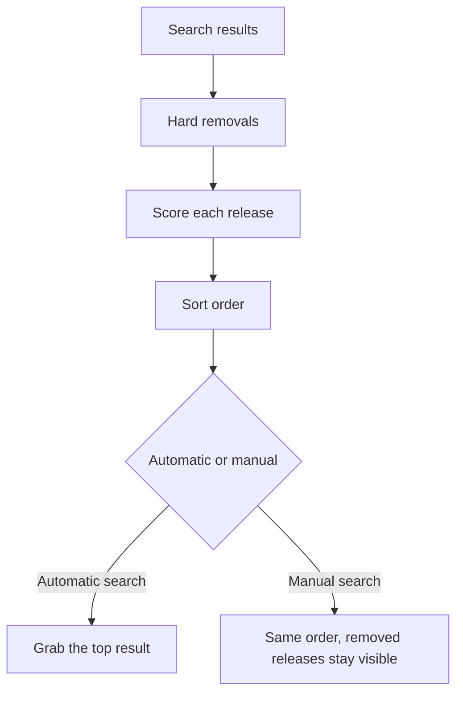

# Mydia

[](https://github.com/getmydia/mydia/actions/workflows/ci.yml)
[](https://docs.mydia.dev)
[](https://testflight.apple.com/join/KFSYxaQP)

**Your personal media companion, built with Phoenix LiveView**

A modern, self-hosted media management platform for tracking, organizing, and monitoring your movies and TV shows.

> **Warning:** Mydia is in early development (0.x.x). Expect breaking changes. [Report issues](https://github.com/getmydia/mydia/issues) or [request features](https://github.com/getmydia/mydia/issues/new).

<p align="center">
  <picture>
    <source media="(prefers-color-scheme: light)" srcset="screenshots/homepage-light.png" />
    
  </picture>
</p>

## Quick Start

**1. Generate secrets:**

```bash
openssl rand -base64 48  # SECRET_KEY_BASE
openssl rand -base64 48  # GUARDIAN_SECRET_KEY
```

**2. Create `docker-compose.yml`:**

```yaml
services:
  mydia:
    image: ghcr.io/getmydia/mydia:latest
    container_name: mydia
    environment:
      - PUID=1000
      - PGID=1000
      - TZ=America/New_York
      - SECRET_KEY_BASE=your-secret-key-base-here
      - GUARDIAN_SECRET_KEY=your-guardian-secret-key-here
      - PHX_HOST=localhost
      - MOVIES_PATH=/media/library/movies
      - TV_PATH=/media/library/tv
    volumes:
      - ./config:/config
      - /path/to/media:/media
    ports:
      - 4000:4000
    restart: unless-stopped
```

**3. Start and access:**

```bash
docker compose up -d
```

Open http://localhost:4000 and create your admin account.

## Features

- **Unified Media Management** - Movies + TV shows with TMDB/TVDB metadata
- **Automated Downloads** - Monitored search, quality profiles, automatic upgrades
- **Release Ranking** - One scorer ranks automatic, manual and upgrade searches: quality profiles, custom formats, audio language, identity checks
- **Download Clients** - qBittorrent, Transmission, rqbit, SABnzbd, NZBGet, debrid providers
- **Indexers** - Prowlarr, Jackett, built-in Cardigann (experimental)
- **Multi-User** - Admin/guest roles with request workflow
- **SSO** - Local auth + OIDC/OpenID Connect
- **Import Lists** - Sync from TMDB watchlists, popular, trending (experimental)
- **Real-Time UI** - Phoenix LiveView with instant updates

## How Mydia Picks a Release

Automatic search, manual search, and the daily upgrade sweep all rank release
candidates through the same code: `Mydia.Indexers.ReleaseRanker` and
`Mydia.Indexers.SearchScorer`. A release becomes scoring input through exactly
one place, `Mydia.Quality.Attrs`, so a codec or source spelling fixed there is
fixed for every search path at once.


```mermaid
flowchart TD
    A[Search results] --> B[Hard removals]
    B --> C[Score each release]
    C --> D[Sort order]
    D --> E{Automatic or manual}
    E -->|Automatic search| F[Grab the top result]
    E -->|Manual search| G[Same order, removed releases stay visible]
```

**Hard removals** drop a release before it is scored: an invalid or fake
release name, a blocked tag, a rejecting custom format, an NZB posted too
recently, an excluded source, a below-floor resolution, an identity mismatch
(wrong season, episode, or a TV-shaped title in a movie search), and zero
title relevance against the query. Manual search turns three of those off on
purpose, the operator's escape hatch: excluded sources, the resolution floor,
and identity removal. A release that fails only one of those three is scored
and sorted normally instead of dropped; an identity mismatch is also sunk to
the bottom, below every release that matches. Everything else on the list
still applies to manual search.

**Sort order**, most significant first: identity match before mismatch,
preferred audio language, position in the profile's preferred-resolution
list, number of matching audio languages, custom format score, then the base
score. Identity is outermost on purpose: a release whose season or episode
does not match the search never outranks one that does, regardless of
language, resolution, or format.

**The score** is quality (about 60%) plus availability plus a small
title-match bonus, cut by 30% if a torrent has zero seeders. Availability
comes from seeders on a log scale for torrents, or completion and grab count
for NZBs. Quality is a weighted blend of the profile's preference lists:
resolution and video codec weigh heaviest, then audio codec, then audio
channels and source, then file size and HDR.

Upgrade *acceptance*, deciding whether a freshly downloaded file replaces the
one on disk, is a separate comparison, `Mydia.Upgrades.Comparator`, scored
with the same quality weights but without custom formats or identity checks.
It compares two analyzed files rather than release names, so there is no
title relevance or seeder count to weigh in.

Full explanation: [Why Mydia Picked That Release](docs/using/explanation/quality-decisions.md).
Custom formats: [Custom Formats](docs/configuration/custom-formats.md).

## Mydia Player

A cross-platform app that streams your library from anywhere over an encrypted
peer-to-peer connection. No port forwarding, no VPN.

<p align="center">
  
</p>

| Home | Shows |
|:----:|:-----:|
|  |  |

| Platform | Get it | Notes |
|---|---|---|
| Android | [Download APK](https://mydia.dev/download/android) | Allow installs from unknown sources; updates itself afterward, track chosen in Settings |
| iOS | [Install via TestFlight](https://testflight.apple.com/join/KFSYxaQP) | Needs the TestFlight app |
| macOS | [Download .dmg](https://mydia.dev/download/macos) | Notarized, updates itself |
| Windows | [Download installer](https://mydia.dev/download/windows) | Per-user install, unsigned build |
| Linux | [Flatpak](https://mydia.dev/download/flatpak) or [.tar.gz](https://mydia.dev/download/linux) | Flatpak recommended |
| Web | Served by your own Mydia server at `/player` | Nothing to install |

**[All platforms and install instructions](https://mydia.dev/download)**

## Documentation

Full documentation available at **[docs.mydia.dev](https://docs.mydia.dev)**

- [Tutorials](https://docs.mydia.dev/latest/using/tutorials/) - get Mydia running from scratch
- [How-to guides](https://docs.mydia.dev/latest/using/how-to/) - install, connect clients and indexers, deploy
- [Reference](https://docs.mydia.dev/latest/using/reference/) - environment variables, configuration, database, API
- [Explanation](https://docs.mydia.dev/latest/using/explanation/) - how Mydia works and why
- [Contributing](https://docs.mydia.dev/latest/contributing/setup/) - development setup

## Screenshots

Shown in the dark theme. Mydia ships light, dark and follow-your-system, and the
dashboard above switches with your GitHub theme.

| Movies | TV Shows | Series | Calendar |
|:------:|:--------:|:------:|:--------:|
|  |  |  |  |

## Contributing

```bash
./dev up -d              # Start development environment
./dev mix ecto.migrate   # Run migrations
./dev mix test           # Run tests
./dev mix precommit      # Run all checks
```

See the [Development Guide](https://docs.mydia.dev/latest/contributing/setup/) for details.

### Documentation

Docs are built with [MkDocs](https://www.mkdocs.org/) and [Material for MkDocs](https://squidfunk.github.io/mkdocs-material/). Requires [uv](https://docs.astral.sh/uv/).

```bash
uv sync --project docs            # Install dependencies
uv run --project docs mkdocs serve   # Serve at http://localhost:8000
uv run --project docs mkdocs build   # Build static site to /site
```

## License

Built with Elixir & Phoenix
