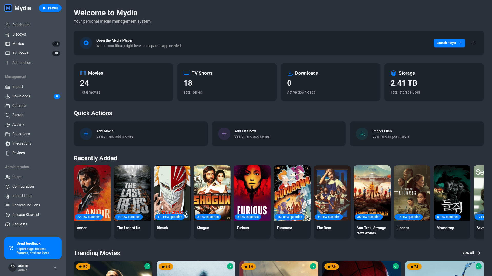
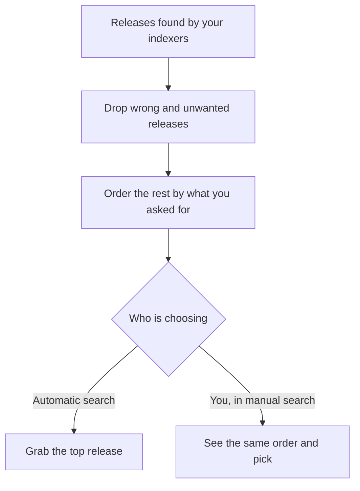
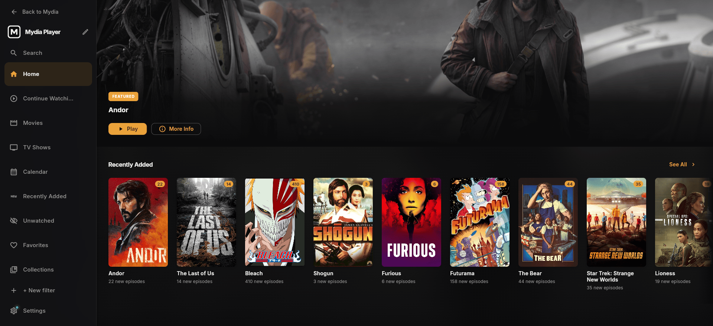
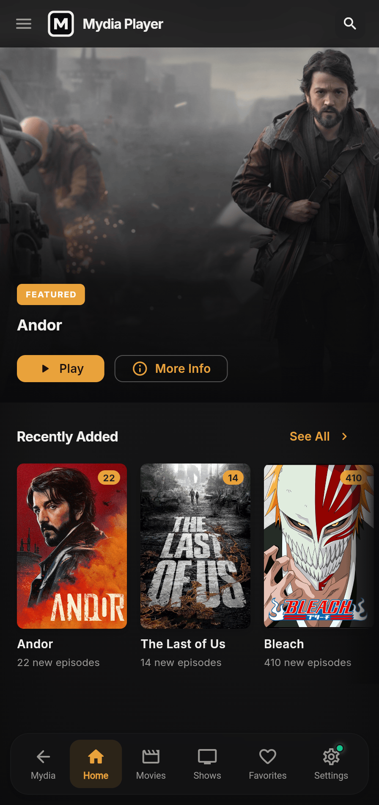
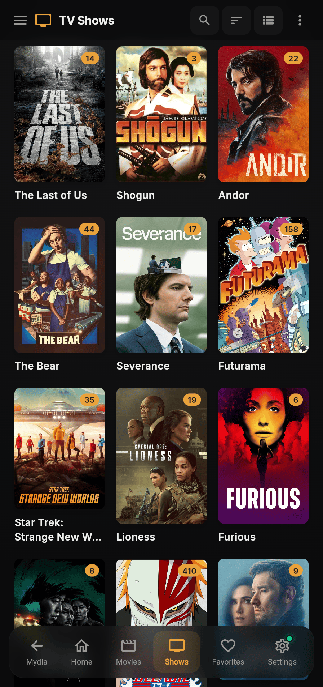
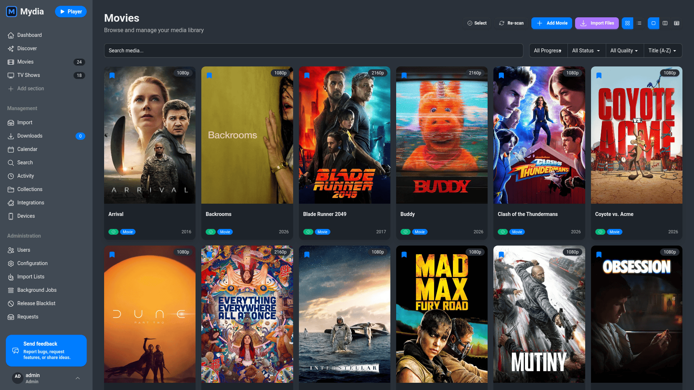
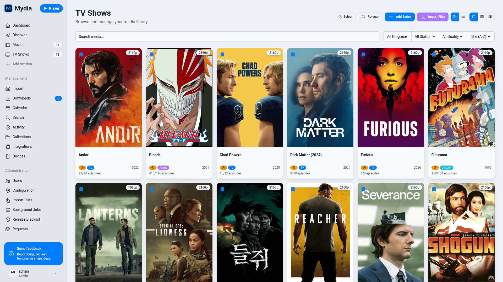
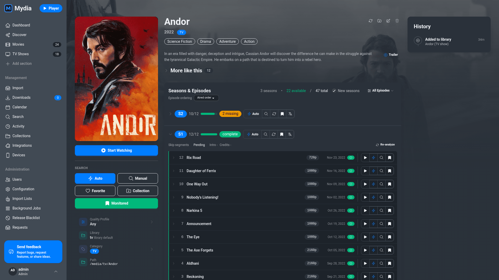
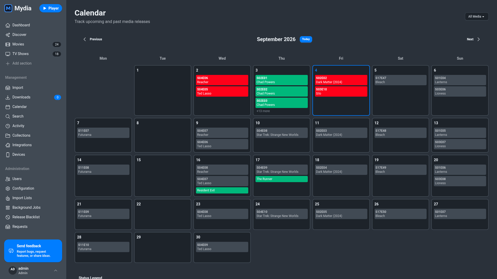

# Mydia

[](https://github.com/getmydia/mydia/actions/workflows/ci.yml)
[](https://docs.mydia.dev)
[](https://testflight.apple.com/join/KFSYxaQP)

**Your personal media companion, built with Phoenix LiveView**

A modern, self-hosted media management platform for tracking, organizing, and monitoring your movies and TV shows.

> **Warning:** Mydia is in early development (0.x.x). Expect breaking changes. [Report issues](https://github.com/getmydia/mydia/issues) or [request features](https://github.com/getmydia/mydia/issues/new).

<p align="center">
  <picture>
    <source media="(prefers-color-scheme: light)" srcset="screenshots/homepage-light.png" />
    
  </picture>
</p>

## Quick Start

**1. Generate secrets:**

```bash
openssl rand -base64 48  # SECRET_KEY_BASE
openssl rand -base64 48  # GUARDIAN_SECRET_KEY
```

**2. Create `docker-compose.yml`:**

```yaml
services:
  mydia:
    image: ghcr.io/getmydia/mydia:latest
    container_name: mydia
    environment:
      - PUID=1000
      - PGID=1000
      - TZ=America/New_York
      - SECRET_KEY_BASE=your-secret-key-base-here
      - GUARDIAN_SECRET_KEY=your-guardian-secret-key-here
      - PHX_HOST=localhost
      - MOVIES_PATH=/media/library/movies
      - TV_PATH=/media/library/tv
    volumes:
      - ./config:/config
      - /path/to/media:/media
    ports:
      - 4000:4000
    restart: unless-stopped
```

**3. Start and access:**

```bash
docker compose up -d
```

Open http://localhost:4000 and create your admin account.

## Features

- **Unified Media Management** - Movies + TV shows with TMDB/TVDB metadata
- **Automated Downloads** - Monitored search, quality profiles, automatic upgrades
- **Release Ranking** - Picks the right release for you: the right episode, your languages, your quality profile and custom formats
- **Download Clients** - qBittorrent, Transmission, rqbit, SABnzbd, NZBGet, debrid providers
- **Indexers** - Prowlarr, Jackett, built-in Cardigann (experimental)
- **Multi-User** - Admin/guest roles with request workflow
- **SSO** - Local auth + OIDC/OpenID Connect
- **Import Lists** - Sync from TMDB watchlists, popular, trending (experimental)
- **Real-Time UI** - Phoenix LiveView with instant updates

## How Mydia Picks a Release

Automatic and manual search rank releases the same way. Automatic search grabs
the top one; manual search shows you the list in that order.


```mermaid
flowchart TD
    A[Releases found by your indexers] --> B[Drop wrong and unwanted releases]
    B --> C[Order the rest by what you asked for]
    C --> D{Who is choosing}
    D -->|Automatic search| E[Grab the top release]
    D -->|You, in manual search| F[See the same order and pick]
```

**Dropped before ranking**

- Fake or malformed release names
- A different title than the one searched *
- Tags you blocked
- Custom formats your profile rejects
- Sources your profile excludes, such as cam rips *
- Resolutions below your profile's minimum *
- Usenet posts too new to be complete

\* Manual search keeps these at the bottom of the list instead.

**Ranking order**, each step only breaking ties left by the one above

1. Right season and episode
2. Preferred audio language
3. Resolution, in your profile's order; unlisted resolutions last
4. Number of preferred audio languages
5. Custom format score
6. Quality score: about 60% profile fit (resolution, codec, audio, source,
   size, HDR), plus seeders or Usenet completeness, plus name match. Torrents
   with 0 seeders lose 30%.

**Upgrades**

- Found with the same ranking
- Must beat your current file by the profile's upgrade margin, or add a
  preferred audio language
- Checked twice: the release before download, the real file after
- Your old file is kept until the new one passes

More detail: [Why Mydia Picked That Release](docs/using/explanation/quality-decisions.md)
and [Custom Formats](docs/configuration/custom-formats.md).

## Mydia Player

A cross-platform app that streams your library from anywhere over an encrypted
peer-to-peer connection. No port forwarding, no VPN.

<p align="center">
  
</p>

| Home | Shows |
|:----:|:-----:|
|  |  |

| Platform | Get it | Notes |
|---|---|---|
| Android | [Download APK](https://mydia.dev/download/android) | Allow installs from unknown sources; updates itself afterward, track chosen in Settings |
| iOS | [Install via TestFlight](https://testflight.apple.com/join/KFSYxaQP) | Needs the TestFlight app |
| macOS | [Download .dmg](https://mydia.dev/download/macos) | Notarized, updates itself |
| Windows | `irm https://mydia.dev/install.ps1 \| iex` in PowerShell, or [download installer](https://mydia.dev/download/windows) | Per-user install. The command avoids the SmartScreen prompt the unsigned installer gets |
| Linux | [Flatpak](https://mydia.dev/download/flatpak) or [.tar.gz](https://mydia.dev/download/linux) | Flatpak recommended |
| Web | Served by your own Mydia server at `/player` | Nothing to install |

**[All platforms and install instructions](https://mydia.dev/download)**

## Documentation

Full documentation available at **[docs.mydia.dev](https://docs.mydia.dev)**

- [Tutorials](https://docs.mydia.dev/latest/using/tutorials/) - get Mydia running from scratch
- [How-to guides](https://docs.mydia.dev/latest/using/how-to/) - install, connect clients and indexers, deploy
- [Reference](https://docs.mydia.dev/latest/using/reference/) - environment variables, configuration, database, API
- [Explanation](https://docs.mydia.dev/latest/using/explanation/) - how Mydia works and why
- [Contributing](https://docs.mydia.dev/latest/contributing/setup/) - development setup

## Screenshots

Shown in the dark theme. Mydia ships light, dark and follow-your-system, and the
dashboard above switches with your GitHub theme.

| Movies | TV Shows | Series | Calendar |
|:------:|:--------:|:------:|:--------:|
|  |  |  |  |

## Contributing

```bash
./dev up -d              # Start development environment
./dev mix ecto.migrate   # Run migrations
./dev mix test           # Run tests
./dev mix precommit      # Run all checks
```

See the [Development Guide](https://docs.mydia.dev/latest/contributing/setup/) for details.

### Documentation

Docs are built with [MkDocs](https://www.mkdocs.org/) and [Material for MkDocs](https://squidfunk.github.io/mkdocs-material/). Requires [uv](https://docs.astral.sh/uv/).

```bash
uv sync --project docs            # Install dependencies
uv run --project docs mkdocs serve   # Serve at http://localhost:8000
uv run --project docs mkdocs build   # Build static site to /site
```

## License

Built with Elixir & Phoenix
