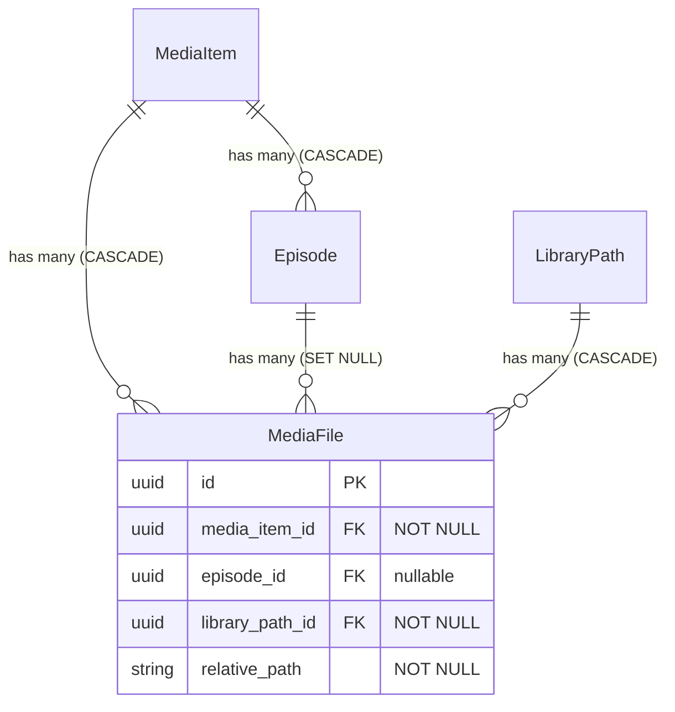

# Eliminate Orphan Media Files

## Overview

Make `media_item_id` NOT NULL on the `media_files` table so that every file always belongs to a `MediaItem`. This eliminates orphan records at the database level and removes ~300 lines of cleanup code that exists solely to patch up orphans after the fact.

Production data shows 1061 files linked only to an episode (no `media_item_id`), 219 true orphans (both parents NULL), and 0 files with both parents set — despite the schema allowing it. The root cause is a design that treats `media_item_id` and `episode_id` as interchangeable optional FKs when they serve different roles: `media_item_id` is ownership, `episode_id` is refinement.

(See brainstorm: `docs/brainstorms/2026-03-23-eliminate-orphan-files-brainstorm.md`)

## Proposed Solution

1. Allow `media_item_id` AND `episode_id` to coexist (drop mutual exclusivity)
2. Make `media_item_id` NOT NULL via migration (backfill existing data first)
3. Update all code paths that create/update MediaFiles to always provide `media_item_id`
4. Remove orphan-handling infrastructure that becomes dead code

### New Parent Association Model

```
Before (current):  media_item_id XOR episode_id  (mutually exclusive, both optional)
After:             media_item_id REQUIRED, episode_id OPTIONAL (can coexist)
```

- **Movies**: `media_item_id` set, `episode_id` NULL
- **TV shows (matched)**: `media_item_id` set, `episode_id` set
- **TV shows (unmatched)**: `media_item_id` set, `episode_id` NULL
- **Adult files**: `media_item_id` set (via linked AdultFile's scene), `episode_id` NULL

### Cascade Behavior (unchanged)

- `media_item_id ON DELETE CASCADE` — deleting a media item deletes its files
- `episode_id ON DELETE SET NULL` — deleting an episode clears the episode link, file stays under the media item

## Technical Approach

### Architecture



### Key Design Principle: Reuse Existing Matching Pipeline

The scanner's matching pipeline (`MetadataMatcher.match_file` → `MetadataEnricher.enrich`) already resolves media items. We must NOT duplicate this logic. Instead, we restructure the scanner loop to call matching BEFORE file creation, using the existing pipeline functions.

The `MetadataEnricher.enrich/2` already accepts `media_file_id` as an **optional** parameter. We can call it without `media_file_id` to get/create the MediaItem first, then create the file with `media_item_id` set, then do episode association as a follow-up.

### Self-Hosted Constraint: Idempotent Migrations

Since Mydia is self-hosted, we cannot control when users run migrations. Every migration must be idempotent:
- Backfill UPDATEs use `WHERE column IS NULL` (no-op if already populated)
- Orphan DELETEs use `WHERE both NULL` (no-op if no orphans exist)
- Table recreation checks if the NOT NULL constraint already exists before running

### Implementation Phases

All phases ship in a single release. The migration runs after code changes are loaded (standard Ecto behavior). The code must handle both the old schema (nullable `media_item_id`) and the new schema (NOT NULL) gracefully.

#### Phase 1: Fix All Code Paths to Always Set `media_item_id`

**1a. Update MetadataEnricher for TV shows**

`lib/mydia/library/metadata_enricher.ex`

The enricher currently skips `associate_media_file` for TV shows (line 59: `if media_file_id && media_type == :movie`). Fix:

- Remove the `media_type == :movie` guard — call `associate_media_file` for ALL types when `media_file_id` is present
- Update `associate_media_file_with_episode/2` (line 432) to also set `media_item_id`:

```elixir
# Before (line 437):
Mydia.Library.update_media_file(media_file, %{episode_id: episode.id})

# After — set both, using the episode's parent:
Mydia.Library.update_media_file(media_file, %{
  media_item_id: episode.media_item_id,
  episode_id: episode.id
})
```

**1b. Update MediaImport job**

`lib/mydia/jobs/media_import.ex` (lines 965-1002)

The download import explicitly sets `media_item_id: nil` when importing episode files. Fix:

```elixir
# Before (line 969-973):
episode && episode.id ->
  Map.merge(attrs, %{episode_id: episode.id, media_item_id: nil})

# After — resolve media_item_id from episode:
episode && episode.id ->
  Map.merge(attrs, %{
    episode_id: episode.id,
    media_item_id: episode.media_item_id
  })
```

The episode is already preloaded at the top of `create_media_file_record/5`. Same fix for `download.episode_id` branch (lines 975-979) — load the episode to get `media_item_id`.

**1c. Update LibraryScanner episode association**

`lib/mydia/jobs/library_scanner.ex`

- `associate_file_with_episode/2` (line 1390): Currently clears `media_item_id` when setting `episode_id`. Fix to set both:

```elixir
# Before:
update_media_file(media_file, %{episode_id: episode.id, media_item_id: nil})

# After:
update_media_file(media_file, %{
  episode_id: episode.id,
  media_item_id: episode.media_item_id
})
```

- `revalidate_tv_file_association/1` (line 1344): Already only sets `episode_id` without touching `media_item_id`. No change needed — the file will already have `media_item_id` set.

**1d. Update Library.match_files_to_episodes/1**

`lib/mydia/library.ex` (line 510)

Currently swaps `media_item_id` for `episode_id`. Keep `media_item_id` and add `episode_id`:

```elixir
# Before:
update_media_file(media_file, %{media_item_id: nil, episode_id: episode.id})

# After — keep existing media_item_id, add episode:
update_media_file(media_file, %{episode_id: episode.id})
```

Since the file already has `media_item_id` set (from creation), we just add `episode_id`. No need to explicitly pass `media_item_id` — it's not being changed.

**1e. Update MediaFile changeset validation**

`lib/mydia/library/media_file.ex`

- Remove `validate_one_parent/1` (enforces mutual exclusivity — no longer desired)
- Remove `validate_parent_exclusivity/1` (scan changeset version of the same)
- Remove `check_constraint(:media_item_id, name: :media_files_parent_check)` from both changesets (no DB constraint exists, but removing the Ecto reference)
- Add `validate_required([:media_item_id])` to `changeset/2`
- Keep `scan_changeset/2` temporarily WITHOUT requiring `media_item_id` — needed for the scanner's create-then-enrich flow until Phase 1g is complete. Mark with a `# TODO: remove after scanner restructure` comment.

**1f. Restructure scanner to match-before-create**

`lib/mydia/jobs/library_scanner.ex`

This is the core architectural change. Currently the scanner loop is:

```
1. Batch-create all new MediaFiles (no parent)     ← lines 530-596
2. Batch-enrich all new MediaFiles (sets parent)    ← lines 700-747
```

Restructure to merge these into a single per-file loop using the EXISTING matching pipeline:

```
For each new file:
  1. Call MetadataMatcher.match_file(file_path, config: metadata_config)  ← existing function
  2. If local match found:
     a. Call MetadataEnricher.enrich(match_result, config: metadata_config)  ← existing function, WITHOUT media_file_id
     b. Get media_item from enricher result
     c. Create MediaFile with media_item_id: media_item.id
     d. If TV show: call associate_media_file_with_episode  ← existing function
  3. If no local match (external only, or no match):
     a. Skip file creation — log reason
     b. File will appear on Import page for manual matching
  4. If trashed file exists at same path:
     a. Restore it (existing behavior)
     b. Update media_item_id if needed
```

No new matching logic is introduced. We call the exact same `MetadataMatcher.match_file` and `MetadataEnricher.enrich` functions — just in a different order. The enricher's `media_file_id` parameter is already optional.

The parallelism model changes from `Task.async_stream` over all files to `Task.async_stream` where each task does match+create+enrich. This preserves back-pressure and concurrency.

**1g. Update adult scanner**

`lib/mydia/jobs/library_scanner.ex` (lines 360-478)

The adult scanner creates `MediaFile` records for thumbnail/playback with no parent. The adult module already has its own entity model (`AdultFile`, linked to scenes). The `MediaFile` is a secondary record used for generated media (covers, sprites).

Fix: Look up the associated `AdultFile` to find the scene/studio, and create or reuse a synthetic `MediaItem`:

```elixir
# After creating the AdultFile (which already happens first via AdultScanner),
# look up the adult_file for this path and create a MediaItem from its metadata:
adult_file = AdultScanner.get_adult_file_by_path(library_path.id, relative_path)

media_item = get_or_create_adult_media_item(adult_file, library_path)

Library.create_scanned_media_file(%{
  library_path_id: library_path.id,
  relative_path: relative_path,
  media_item_id: media_item.id,
  size: file_info.size,
  verified_at: DateTime.utc_now()
})
```

**1h. Update import page flow**

`lib/mydia_web/live/import_media_live/index.ex`

The import page currently creates a `MediaFile` before enrichment (line 1877). Restructure to enrich first:

```elixir
# Before:
{:ok, media_file} = Library.create_scanned_media_file(%{...no parent...})
MetadataEnricher.enrich(match_result, media_file_id: media_file.id)

# After:
{:ok, media_item} = MetadataEnricher.enrich(match_result, config: metadata_config)
{:ok, media_file} = Library.create_scanned_media_file(%{
  library_path_id: library_path.id,
  relative_path: relative_path,
  media_item_id: media_item.id,
  size: file_info.size,
  verified_at: DateTime.utc_now()
})
# For TV shows, associate with episode using existing function
```

Remove the orphan re-matching logic (`orphaned_files_map`, `orphaned_media_file_id`, `orphaned_non_specialized_file?/1`).

**1i. Update Library.create_media_files_for_series/3 and create_media_files_for_movie/3**

`lib/mydia/library.ex` (lines 1131, 1212)

These functions already have the media item context available. Ensure they pass `media_item_id` when calling `create_scanned_media_file`.

#### Phase 2: Migration (Idempotent)

`priv/repo/migrations/TIMESTAMP_enforce_media_item_on_media_files.exs`

```elixir
defmodule Mydia.Repo.Migrations.EnforceMediaItemOnMediaFiles do
  use Ecto.Migration
  import Mydia.Repo.Migrations.Helpers

  def change do
    # Check if migration is needed (idempotent)
    # SQLite pragma_table_info tells us if column is already NOT NULL
    execute(fn ->
      result =
        repo().query!("SELECT \"notnull\" FROM pragma_table_info('media_files') WHERE name = 'media_item_id'")

      already_not_null = result.rows == [[1]]

      if already_not_null do
        # Migration already applied — skip
        :ok
      else
        # Step 1: Backfill media_item_id from episode.media_item_id
        # Idempotent: only updates rows where media_item_id IS NULL
        repo().query!("""
          UPDATE media_files
          SET media_item_id = (
            SELECT episodes.media_item_id
            FROM episodes
            WHERE episodes.id = media_files.episode_id
          )
          WHERE media_files.media_item_id IS NULL
            AND media_files.episode_id IS NOT NULL
        """)

        # Step 2: Delete true orphans (both parents NULL)
        # Idempotent: only deletes rows matching the condition
        repo().query!("""
          DELETE FROM media_files
          WHERE media_item_id IS NULL AND episode_id IS NULL
        """)

        # Step 3: Safety check — abort if any NULLs remain
        %{rows: [[count]]} =
          repo().query!("SELECT COUNT(*) FROM media_files WHERE media_item_id IS NULL")

        if count > 0 do
          raise "Cannot apply NOT NULL: #{count} media_files still have NULL media_item_id"
        end

        # Step 4: Recreate table with NOT NULL on media_item_id
        # Also removes the mutual exclusivity assumption
        # (no CHECK constraint existed at DB level, only Ecto-level)
        :ok
      end
    end, fn -> :ok end)

    # Step 4: recreate_table handles the actual schema change
    # The helper copies data, drops old table, creates new, copies back
    recreate_table(:media_files, fn table ->
      add :id, :binary_id, primary_key: true
      add :relative_path, :string, null: false
      add :path, :string
      add :size, :bigint
      add :resolution, :string
      add :codec, :string
      add :audio_codec, :string
      add :bitrate, :integer
      add :hdr_format, :string
      add :metadata, :map
      add :verified_at, :utc_datetime
      add :cover_blob, :string
      add :sprite_blob, :string
      add :vtt_blob, :string
      add :preview_blob, :string
      add :phash, :string
      add :generated_at, :utc_datetime
      add :trashed_at, :utc_datetime

      add :media_item_id, references(:media_items, type: :binary_id, on_delete: :delete_all),
        null: false

      add :episode_id, references(:episodes, type: :binary_id, on_delete: :nilify_all)
      add :library_path_id, references(:library_paths, type: :binary_id, on_delete: :delete_all),
        null: false

      add :quality_profile_id, references(:quality_profiles, type: :binary_id, on_delete: :nilify_all)

      timestamps(type: :utc_datetime)
    end)
  end
end
```

> **Note:** The `recreate_table` helper from `Mydia.Repo.Migrations.Helpers` is already used in the cascade fix migration. It handles: copy to temp table → drop original → create new with updated schema → copy data back → recreate indexes. This happens inside a transaction — if any step fails, SQLite rolls back entirely.

#### Phase 3: Remove Orphan Infrastructure

Ship in the same release. Code that handled orphans becomes dead:

| File | What to Remove/Simplify |
|---|---|
| `lib/mydia/library.ex` | Remove `list_orphaned_media_files/1`, `orphaned_media_file?/1` |
| `lib/mydia/library/database_health_check.ex` | Remove `count_orphaned_files/0`, simplify `detect_issues/0` |
| `lib/mydia/jobs/library_scanner.ex` | Remove "completely orphaned" re-enrichment (lines 766-808), remove "TV orphan fix" (lines 810-834) |
| `lib/mydia_web/live/import_media_live/index.ex` | Remove `orphaned_files_map`, `orphaned_media_file_id`, `orphaned_non_specialized_file?/1` |
| `lib/mydia_web/live/import_media_live/components.ex` | Remove `:orphaned` from scan_stats |
| `config/config.exs`, `config/dev.exs` | Remove `:orphaned_files_fixed`, `:tv_orphans_fixed` config keys |
| `lib/mydia/library/media_file.ex` | Merge `scan_changeset/2` into `changeset/2`, remove `validate_parent_exclusivity/1`, remove `validate_one_parent/1` |

Tests to update:
- `test/mydia/library_test.exs` — remove "orphaned media file" tests (lines 73-108, 169-175)
- `test/mydia/library/media_file_test.exs` — remove "allows orphaned files" test (line 202), add "requires media_item_id" test
- `test/mydia/library/database_health_check_test.exs` — remove orphaned file counting tests
- `test/mydia/library/migration_validation_test.exs` — update orphaned file handling tests
- `test/mydia/library/file_organizer_test.exs` — update orphan fixture (line 349)

## System-Wide Impact

### Interaction Graph

1. Scanner discovers file → matches via `MetadataMatcher.match_file` (existing) → enriches via `MetadataEnricher.enrich` (existing) → creates `MediaFile` with `media_item_id` → episode association follows for TV
2. Import page selects match → enricher creates/finds `MediaItem` → creates `MediaFile` with `media_item_id` → episode association for TV
3. Download completes → `MediaImport` resolves `media_item_id` from episode → creates `MediaFile`
4. Episode deleted → `episode_id` SET NULL → file retains `media_item_id` (no orphan possible)
5. MediaItem deleted → CASCADE deletes all files (unchanged)

### Error Propagation

- **Scanner can't match file**: file not created in DB, logged as skipped. File still exists on disk and appears on Import page for manual matching. No orphan created.
- **FK violation on insert** (race condition): MediaItem deleted between enrichment and file insert → FK constraint rejects insert → scanner logs and skips → file re-discovered next scan.
- **Migration backfill failure**: safety check aborts before table recreation → SQLite rolls back → DB unchanged → investigate and fix manually.

### State Lifecycle Risks

- **During migration**: `recreate_table` is transactional in SQLite. Failure → full rollback. Automatic backups provide belt-and-suspenders safety.
- **Code/migration ordering**: Code changes are backwards-compatible — they work with both nullable and NOT NULL `media_item_id`. The migration is idempotent — safe to run multiple times. No deployment order dependency.
- **Scanner mid-flight**: If a scan is running during migration, files created with the old code (NULL parent) will fail the migration's safety check. Mitigation: the migration deletes true orphans first. Files with only `episode_id` get backfilled. The only failure case is a file created between Step 2 and Step 3 with NULL `media_item_id` and non-NULL `episode_id` that hasn't been backfilled — extremely unlikely given the migration runs in a single transaction.

### API Surface Parity

All code paths that create `MediaFile` records:

| Code Path | File | Creates with `media_item_id`? |
|---|---|---|
| `Library.create_media_file/1` | `library.ex:183` | After Phase 1e: yes (changeset validates) |
| `Library.create_scanned_media_file/1` | `library.ex:196` | After Phase 1f: yes (scanner provides it) |
| `Library.create_media_files_for_series/3` | `library.ex:1131` | After Phase 1i: yes (already has context) |
| `Library.create_media_files_for_movie/3` | `library.ex:1212` | After Phase 1i: yes (already has context) |
| Scanner `process_scan_result` | `library_scanner.ex` | After Phase 1f: yes (match-before-create) |
| Scanner `process_adult_scan_result` | `library_scanner.ex:377` | After Phase 1g: yes (linked to AdultFile's MediaItem) |
| Import page | `import_media_live/index.ex:1877` | After Phase 1h: yes (enrich-first) |
| MediaImport job | `media_import.ex:1004` | After Phase 1b: yes |

## Acceptance Criteria

### Functional Requirements

- [ ] `media_item_id` is NOT NULL on `media_files` table
- [ ] Every new MediaFile has `media_item_id` set at creation time
- [ ] TV show files have both `media_item_id` AND `episode_id` set
- [ ] Movie files have `media_item_id` set, `episode_id` NULL
- [ ] Adult files have `media_item_id` set
- [ ] Scanner skips files it can't match to a local MediaItem (uses existing MetadataMatcher)
- [ ] Skipped files appear on the Import page for manual matching
- [ ] Episode deletion clears `episode_id` but file retains `media_item_id`
- [ ] MediaItem deletion cascades to delete files (unchanged)
- [ ] Migration backfills episode-only files from `episode.media_item_id`
- [ ] Migration deletes true orphans (both parents NULL)
- [ ] Migration is idempotent (safe to run multiple times)

### Non-Functional Requirements

- [ ] Migration completes safely on production SQLite database
- [ ] No data loss for files with valid parent associations
- [ ] No duplication of matching logic — all matching uses existing `MetadataMatcher`/`MetadataEnricher`

### Quality Gates

- [ ] All existing tests pass (with updates for new model)
- [ ] Orphan infrastructure functions removed
- [ ] `mix compile --warnings-as-errors` passes (excluding pre-existing warning)

## Risk Analysis & Mitigation

| Risk | Likelihood | Impact | Mitigation |
|---|---|---|---|
| Migration fails mid-recreation | Low | High | SQLite transaction rollback + automatic backup |
| Scanner skips too many files | Medium | Medium | Only skips files not matching local DB items — same files that were orphans before. Import page remains the fallback. |
| Race condition during scan | Low | Low | FK constraint catches it; file re-discovered next scan |
| Adult files need MediaItem | Medium | Low | Create synthetic MediaItem linked to AdultFile metadata |
| Migration runs with old code still active | Low | Medium | Migration's safety check catches NULL rows; idempotent re-run after code update |

## Sources & References

### Origin

- **Brainstorm document:** [docs/brainstorms/2026-03-23-eliminate-orphan-files-brainstorm.md](docs/brainstorms/2026-03-23-eliminate-orphan-files-brainstorm.md)
  - Key decisions: media_item_id NOT NULL, keep CASCADE delete, scanner uses existing matching pipeline

### Internal References

- MediaFile schema: `lib/mydia/library/media_file.ex:153-199` (current mutual exclusivity validation)
- MetadataEnricher: `lib/mydia/library/metadata_enricher.ex:35-100` (enrich function, media_file_id is optional)
- MetadataEnricher TV association: `lib/mydia/library/metadata_enricher.ex:432-452` (sets only episode_id, not media_item_id)
- Scanner file creation: `lib/mydia/jobs/library_scanner.ex:530-596` (creates files without parent)
- Scanner enrichment: `lib/mydia/jobs/library_scanner.ex:700-747` (enriches after creation)
- Scanner matching: `lib/mydia/jobs/library_scanner.ex:1048-1134` (MetadataMatcher.match_file call)
- MediaImport episode handling: `lib/mydia/jobs/media_import.ex:965-1002` (sets media_item_id: nil)
- Cascade fix migration: `priv/repo/migrations/20260322000000_fix_episode_cascade_deletes.exs`
- Import page orphan handling: `lib/mydia_web/live/import_media_live/index.ex:1184-1242`
- Adult scanner: `lib/mydia/jobs/library_scanner.ex:360-478` (creates MediaFile with no parent)
